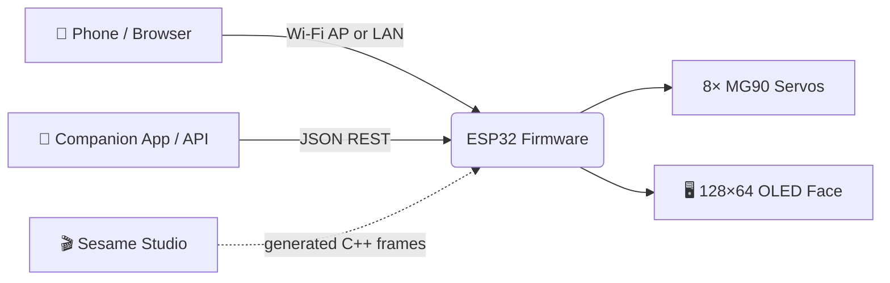

# 🤖 Sesame Robot

### Your new best friend — an open-source, 3D-printed, ESP32 quadruped with a face.

**[Build it](#-getting-started) · [Features](#-features) · [Faces](#-expressive-faces) · [Software](#-software--firmware) · [Contribute](#-contributing)**

---

> [!NOTE]
> **Hardware Replication & Makerspace Bring-Up by Soham Kadu**:  
> This repository hosts the firmware, CAD files, and V3.1 power distribution PCB designs for the open-source Sesame Quadruped Robot originally developed by [Dorian Borian](https://github.com/dorianborian/sesame-robot).  
> **Physical 3D printing, circuit assembly, servo calibration, and testing conducted by Soham Kadu** at Sanjivani Tinkerers' Lab.

## 👋 About

Sesame is an accessible open-source robotics project built on the **ESP32**, with an emphasis on **expression and movement**.
It is designed for makers and engineers of all skill levels — a friendly first step into walking robots.

| 🔧 You need | 💰 Budget | 🖨️ Tools |
|---|---|---|
| Basic soldering skills | ~$50–60 in parts | A 3D printer (PLA) |
| Basic Arduino IDE knowledge | 8× MG90 servos | 128×64 OLED display |

This repository has the CAD and STL files, build and wiring guides, distro board PCBs, the firmware, and the Sesame Studio animation composer.

## ✨ Features

| | |
|---|---|
| 🦿 **Quadruped design** | 8 servos (2 per leg), 8 degrees of freedom |
| 😊 **Emotive display** | 128×64 OLED face that syncs with movement |
| 🖨️ **Fully printable** | PLA, minimal supports |
| 📱 **Phone web UI** | Built-in Access Point with a touch controller and gamepad support |
| 🌐 **JSON REST API** | Control from Python, JavaScript and more |
| 🗣️ **Conversational faces** | Talk variants for voice-assistant projects |
| 🎬 **Sesame Studio** | Desktop composer that generates animation code |
| 🎙️ **Companion app** | Voice control and advanced interactions |
| ⌨️ **Serial CLI** | Trigger animations from the serial monitor |
| 💃 **Pre-programmed emotes** | Walk, wave, dance, swim, pushup, bow and more |

## 😎 Expressive Faces

<table>
<tr><td align="center"> default</td>
<td align="center"> walk</td>
<td align="center"> wave</td>
<td align="center"> dance</td>
<td align="center"> swim</td>
<td align="center"> point</td></tr>
<tr><td align="center"> pushup</td>
<td align="center"> bow</td>
<td align="center"> cute</td>
<td align="center"> freaky</td>
<td align="center"> worm</td>
<td align="center"> shake</td></tr>
<tr><td align="center"> shrug</td>
<td align="center"> dead</td>
<td align="center"> crab</td>
<td align="center"> rest</td>
<td align="center"> stand</td>
<td align="center"> walk2</td></tr>
</table>

## 🧩 How it works

## 🚀 Getting Started

| Step | What to do |
|---|---|
| **1. 🛒 Gather parts** | See the **[Bill of Materials](hardware/bom/README.md)**. |
| **2. 🖨️ Print** | STLs and the **[Printing Guide](hardware/printing/README.md)** — PLA, minimal supports. |
| **3. 🔌 Build & wire** | **[Build Guide](docs/build-guide/README.md)** and **[Wiring Guide](docs/wiring-guide/README.md)**. |
| **4. ⚡ Flash** | Upload from **[firmware/](firmware/README.md)** with Arduino IDE and configure the Wi-Fi AP. |
| **5. 🎬 Animate** | Design poses in **[Sesame Studio](software/sesame-studio/README.md)**. |

**Controller options:**
- Microcontroller: Lolin S2 Mini (recommended for DIY), Sesame Distro Board V3 (current, pre-flashed, supports Bambu Lab battery), V2 (legacy, USB-only), or ESP32-DevKitC-32E with Distro Board V1 (legacy)
- Actuators: 8× 180° MG90 servos
- Power: 5V 3A (USB-C PD, or battery + buck converter — see BOM)

## 📺 Launch video

---

## 🧰 Software & Firmware

### 🎬 Sesame Studio
Sesame Studio is a standalone desktop application included in `software/sesame-studio/`. It allows you to:
*   Visually pose the robot using a schematic interface.
*   Generate C++ code for servo angles automatically.
*   Sequence frames into complex animations.

[**> Go to Sesame Studio**](software/sesame-studio/README.md)

### 🧪 Sesame Simulator
The Sesame Simulator, created by Jay Li, is a Rust-based 3D simulation environment for testing Sesame's movements and kinematics in a virtual space. It features:
*   **Physics-based Simulation:** Test walking and balance without hardware.
*   **Web-based Interface:** Run the simulator directly in your browser.
*   **URDF Integration:** Accurate modeling of Sesame's physical properties.

[**> Go to Sesame Simulator**](https://one-for-all.github.io/sesame-robot-sim/)

### 🎙️ Sesame Companion App
The Sesame Companion App is a Python-based application that enables advanced control and interaction with your robot over your local network. It leverages the new JSON API and network mode features to provide:
*   **Voice Assistant Integration:** Control Sesame with voice commands and see real-time emotional expressions.
*   **Remote Control:** Command your robot from anywhere on your local network.
*   **Face Control:** Change expressions dynamically based on conversation or context.
*   **API Examples:** Reference implementation for building your own integrations.

The Companion App works with robots running the latest firmware with network mode enabled.

[**> Go to Sesame Companion App Repository**](https://github.com/dorianborian/sesame-companion-app)

### ⚡ Firmware
The ESP32 firmware (`sesame-firmware-main.ino`) handles the kinematics, face display, and WiFi control interface.
*   **Web UI:** Control the robot from your phone via the built-in Access Point.
*   **Custom Faces:** Add your own bitmaps (guide in firmware docs).

[**> Go to Firmware Docs**](firmware/README.md)

---

---

## 🤝 Contributing

This robot is a platform for new features, cosmetics, tools and ideas. Pull requests are very welcome for:

- 🦴 Kinematics improvements
- 💃 New animations
- 🎨 Improved Web UI/UX
- 📡 Sensor integration (ultrasonic, gyro, etc.)

Forks with new hardware, software or faces are encouraged too — share what you build!

## 📜 License

Released under the [Apache 2.0 License](LICENSE).

---

*Original project created by [Dorian Todd](https://www.doriantodd.com/) — help on Discord: **starphee**.*
*This fork is maintained by [soham0777](https://github.com/soham0777).* ⭐ Star the repo if you like it!

